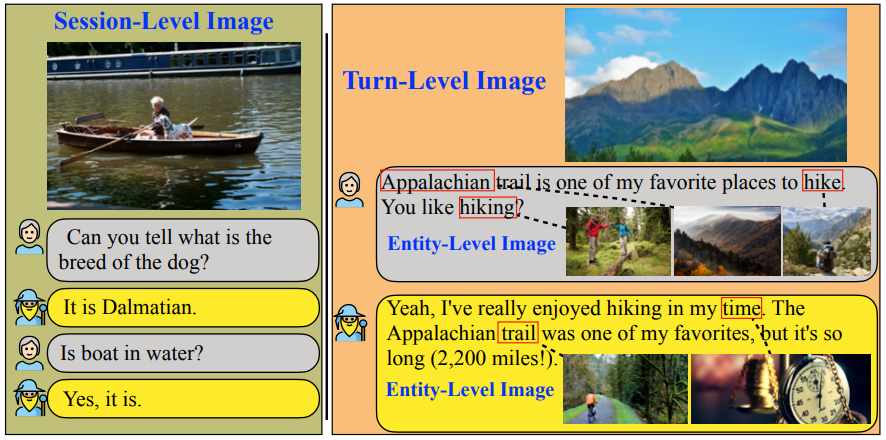

# ReSee: Responding through Seeing Fine-grained Visual Knowledge in Open-domain Dialogue (In Progress)

[Haoqin Tu](https://www.haqtu.me/), [Yitong Li](https://lrank.github.io/), [Fei Mi](https://mifei.github.io/), [Zhongliang Yang](https://scholar.google.com/citations?user=jQ8vpPkAAAAJ&hl=zh-CN)

[](https://github.com/tatsu-lab/stanford_alpaca/blob/main/LICENSE)
[](https://github.com/tatsu-lab/stanford_alpaca/blob/main/DATA_LICENSE)

Our paper is online now: https://arxiv.org/abs/2305.13602, ReSee is **accepted to EMNLP2023 (long oral)**

<p align="center">
  
</p>

## Installation
Make sure you have installed the following packages:
```bash
transformers>=3.0.1
numpy
torch
tensorboardX
```

## Datasets
We host our *processed datasets* [here](https://huggingface.co/datasets/PahaII/ReSee_data/tree/main), please download then unzip the it, and modify the `DATA_DIR` in `config.json` accordingly. The unzipped data should look like this:

```
.
├── ./processed_resee_data  
    ├── dd # Contains proccessed entity-level image features and annotations of DailyDialogue
        ├── processed_img_features
            └── img_clip_features.pt
        ├── test_v0.json
        ├── valid_v0.json
        └── train_v0.json
    ├── wow # Contains proccessed entity-level image features and annotations of Wizard of Wikipedia
        ├── processed_img_features
            └── img_clip_features.pt
        ├── test_random_v0.json
        ├── test_topic_v0.json
        ├── train_v0.json
        ├── valid_random_v0.json
        └── valid_topic_v0.json
    └── shared # Turn-level image features
        ├── coco
        ├── flickr30
        ├── nocaps
        ├── openimagev6
        ├── processed_img_features_clip_base # turn-level image features processed by ViT base
            ├── coco_train_clip_vis_fea.pt
            ├── coco_val_clip_vis_fea.pt
            ├── flickr30_clip_vis_fea.pt
            ├── nocaps_clip_vis_fea.pt
            ├── openimagev6_test_clip_vis_fea.pt
            ├── openimagev6_train_clip_vis_fea.pt
            ├── openimagev6_val_clip_vis_fea.pt
            └── oodcv-counterfactual.json
        └── processed_img_features_clip_large # turn-level image features processed by ViT large
            ├── coco_train_clip_vis_fea.pt
            ├── coco_val_clip_vis_fea.pt
            ├── flickr30_clip_vis_fea.pt
            ├── nocaps_clip_vis_fea.pt
            ├── openimagev6_test_clip_vis_fea.pt
            ├── openimagev6_train_clip_vis_fea.pt
            ├── openimagev6_val_clip_vis_fea.pt
            └── oodcv-counterfactual.json
```

We are **still processing the raw image data** of entity-level images (maximum 5 images per entity, requiring up to 36G storage). **Stay tuned for the full image data!**

For the text-only dialogue data our visual data is built upon, please refer to their own databases:

- DailyDialog: http://yanran.li/dailydialog.html
- Wizard of Wikipedia: https://parl.ai/projects/wizard_of_wikipedia/

Please put text-only dialogue data in `processed_resee_data/wow` or `processed_resee_data/dd`, respectively.

## Training
For training ReSee (Sep.) based on T5 on both datasets, run the following command:
```bash
DATA=WOW # DD

python run.py --do_train --dataset ${DATA} --history_in_context --img_add_pos concat --log_epoch 5 --per_gpu_train_batch_size 12 --learning_rate 5e-3 --max_ent_img_seq_length 8 --do_sample --test_iter 5000 --model_type t5 --max_val_batches 100 --num_train_epochs 30 --max_seq_length 185 --max_seq_a_length 35 --max_episode_length 1 --add_textual_ent
```

For training ReSee (Share) based on UniLM on both datasets, run:
```bash
DATA=WOW # DD
UNILM_PTH=/your/path/to/unilm-weight

python run.py --do_train --dataset ${DATA} --history_in_context --img_add_pos concat --log_epoch 5 --per_gpu_train_batch_size 12 --learning_rate 5e-3 --max_ent_img_seq_length 8 --do_sample --test_iter 5000 --model_type unilm --max_val_batches 100 --num_train_epochs 30 --max_seq_length 185 --max_seq_a_length 35 --max_episode_length 1 --add_textual_ent --unilm_cache ${UNILM_PTH}
```
Note that you need to specify the path of UniLM weight (`--unilm_cache`) here.

We add the entity-level and turn-level visual information by default, you can delete them by setting `--no_ent_vis` and `--no_turn_vis` severally. The `--add_textual_ent` flag is for adding textual entity for training. 

And if you want to add document knowledge in ReSee-WoW dataset, please add `--knowledge_len 210`.

## Evaluation
First you need to download the evaluation kit from the [Google Drive](https://drive.google.com/file/d/1n6rbqtdt4AV4S1VnwQzEopYhD0iTSY9O/view?usp=drive_link), then unzip it in the `./utils` folder.

Run the following to evaluate the model:
```bash
DATA=WOW # DD
RESULT_FILE=/path/to/result/file

python3 run.py --do_sample --history_in_context --img_add_pos concat --max_test_batches 1e9 --dataset ${DATA} --do_sample --max_seq_length 190 --max_ent_img_seq_length 8 --evaluate_cache ${RESULT_FILE} --top_k 1 --top_p 0.1 --max_seq_a_length 35 --ent_img_num 1 &&\

python3 evaluate.py --eval_file ${RESULT_FILE} --out_to_file
```


## Citation
If you find our work useful to your research and applications, please consider citing the paper and staring the repo :)

```bibtex
@inproceedings{tu2023resee,
      title={ReSee: Responding through Seeing Fine-grained Visual Knowledge in Open-domain Dialogue}, 
      author={Tu, Haoqin and Li, Yitong and Mi, Fei and Yang, Zhongliang},
      booktitle={EMNLP},
      year={2023},
}
```